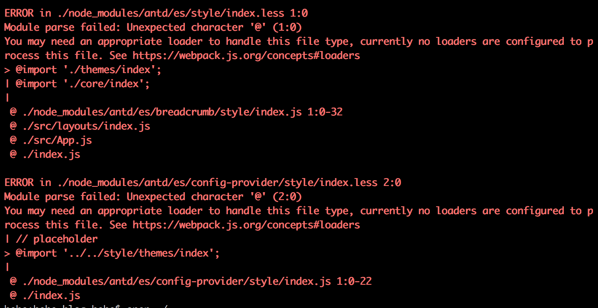
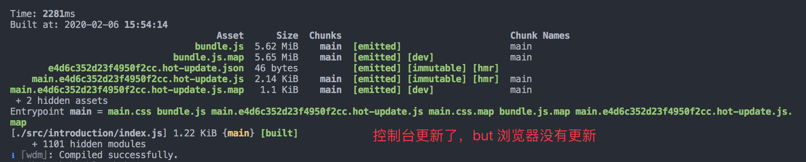
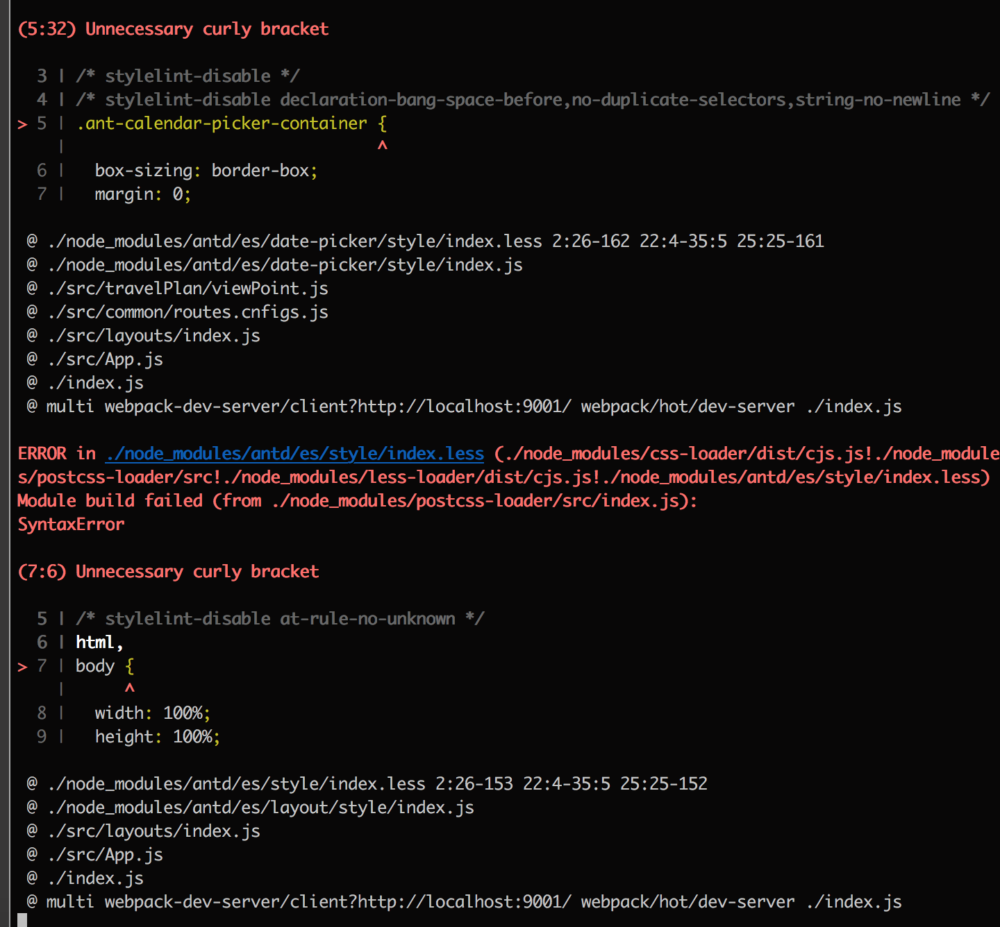

# 记录

利用学习 webpack 的机会，使用 react + antd + es6 并且不使用脚手架，自己搭建整个项目。

## 版本变更记录

### 1.0.1

- 解决 es6\less\antd 的打包问题

## 命令

- 打包：webpack
- 启动：npm run build
- nginx 前端端口 9000， 9001 是不能连接后端的

## 错误处理

1. 运行`webpack`命令时报错
   

解决办法：

```json
{
  test: /\.(le|c)ss$/,
  // exclude: /node_modules/,
  // include: [
  //   path.resolve(__dirname, ".."),
  //   path.resolve(__dirname, "src")
  // ],
  use: [
    // MiniCssExtractPlugin.loader,
    "style-loader",
    "css-loader", // 编译css
    "postcss-loader", // 使用 postcss 为 css 加上浏览器前缀
    "less-loader" // 编译less
  ]
},
```

在`css-loader`中不能不包括`node_modules`中的处理！！！
需要验证下：node_modules/antd 是只添加 antd 到 css-loader 中处理还是全部包含好？

2. 控制台更新了，但是浏览器并没有热更新



<a href="#hot">解决办法</a>

3. 当 webpack 解析时，`postcss-loader`的使用报错



4. webpack 时报错

```shell
WARNING in ./node_modules/antd/es/style/index.less (./node_modules/css-loader/dist/cjs.js!./node_modules/postcss-loader/src!./node_modules/less-loader/dist/cjs.js!./node_modules/antd/es/style/index.less)
Module Warning (from ./node_modules/postcss-loader/src/index.js):
Warning

(639:3) variable '--antd-wave-shadow-color' is undefined and used without a fallback
 @ ./node_modules/antd/es/style/index.less 2:26-153 22:4-35:5 25:25-152
 @ ./node_modules/antd/es/layout/style/index.js
 @ ./src/layouts/index.js
 @ ./src/App.js
 @ ./index.js
 @ multi webpack-dev-server/client?http://localhost:9001/ webpack/hot/dev-server ./index.js
```

这事是警告，并不是报错，如果不想看这些警告，可以在`postcss.config.js`将警告不展示:

```json
"postcss-cssnext": {
  features: {
    customProperties: {
      warnings: false
    }
  }
},
```

5. 将`postcss-loade`的一些配置信息放到 webpack.config.js 中，再`webpack`就报错：

```shell
ERROR in ./node_modules/antd/es/style/index.less (./node_modules/css-loader/dist/cjs.js!./node_modules/postcss-loader/src??postcss!./node_modules/less-loader/dist/cjs.js!./node_modules/antd/es/style/index.less)
Module build failed (from ./node_modules/postcss-loader/src/index.js):
TypeError: Cannot read property 'length' of undefined
    at /Users/heyingchun/study/webpack-hello-world/hehe-blog/node_modules/antd/es/style/index.less:310:1
    at /Users/heyingchun/study/webpack-hello-world/hehe-blog/node_modules/postcss-minify-selectors/dist/index.js:186:35
    at /Users/heyingchun/study/webpack-hello-world/hehe-blog/node_modules/postcss/lib/container.js:239:18
    at /Users/heyingchun/study/webpack-hello-world/hehe-blog/node_modules/postcss/lib/container.js:135:18
    at Root.each (/Users/heyingchun/study/webpack-hello-world/hehe-blog/node_modules/postcss/lib/container.js:101:16)
    at Root.walk (/Users/heyingchun/study/webpack-hello-world/hehe-blog/node_modules/postcss/lib/container.js:131:17)
    at Root.walkRules (/Users/heyingchun/study/webpack-hello-world/hehe-blog/node_modules/postcss/lib/container.js:237:19)
    at /Users/heyingchun/study/webpack-hello-world/hehe-blog/node_modules/postcss-minify-selectors/dist/index.js:181:13
    at initializePlugin (/Users/heyingchun/study/webpack-hello-world/hehe-blog/node_modules/cssnano/dist/index.js:31:51)
 @ ./node_modules/antd/es/style/index.less 2:26-162 22:4-35:5 25:25-161
 @ ./node_modules/antd/es/layout/style/index.js
 @ ./src/layouts/index.js
 @ ./src/App.js
 @ ./index.js
 @ multi webpack-dev-server/client?http://localhost:9001/ webpack/hot/dev-server ./index.js
```

而`postcss-loader`的配置是：

```json

        test: /\.(le|c)ss$/,
        use: [
          // MiniCssExtractPlugin.loader,
          "style-loader",
          "css-loader", // 编译css
          // "postcss-loader", // 使用 postcss 为 css 加上浏览器前缀
          {
            loader: "postcss-loader",
            options: {
              ident: "postcss",
              plugins: loader => [
                require("postcss-import")({}),
                require("postcss-preset-env")(),
                require("postcss-cssnext")({
                  features: {
                    customProperties: {
                      warnings: false
                    }
                  }
                }),
                require("cssnano")()
              ]
            }
          },
          "less-loader" // 编译less
        ]
      },
```

这个报错的原因是，是用了`require("postcss-preset-env")()`,将其屏蔽后就可以啦。

## 插件使用

### 如何使用`@font-face`

这样处理文件即可。将文件打包进 dist 中

```json
{
  test: /\.(png|jpg|jpeg|gif|svg|woff|woff2|eot|ttf|otf)$/,
  use: [
    {
      loader: "file-loader",
      options: {
        // dev 可以这样，正式不行
        name: "[name].[ext]", // 原本的名字和后缀
        outputPath: "assets/fonts"
      }
    }
  ]
},
```

但是发现项目中没有必要这样使用，所以讲@font-face 的内容删除了。

### MiniCssExtractPlugin

该插件将 CSS 提取到单独的文件中。它为每个包含 CSS 的 JS 文件创建一个 CSS 文件。它支持 CSS 和 SourceMap 的按需加载。

它基于新的 webpack v4 功能（模块类型）构建，并且需要 webpack 4 才能正常工作。

- 安装

`npm install --save-dev mini-css-extract-plugin`

**此插件应仅在 production 不包含 style-loader 在加载程序链中的构建中使用，尤其是如果您想在中包含 HMR development。**

这是一个将 HMR development 和样式都提取到 production 构建文件中的示例。

### 添加 less 的处理

npm install less --save-dev
npm install less-loader --save-dev

```js
{
        test: /\.less$/,
        //  Loader:模块转化器，用于将模块的原内容按照需求转换成新内容。
        loaders: ExtractTextPlugin.extract({
          use: ["css-loader", "less-loader"]
        })
      },

      {
        test: /\.(le|c)ss$/,
        use: [
          "style-loader", //使用<style>将css-loader内部样式注入到我们的HTML页面
          "css-loader", // 编译css
          "less-loader" // 编译less
        ]
      },
```

## <div id="hot">添加浏览器自动刷新和模块热替换</div>

`webpack.dev.config.js`：

```json
const HotModuleReplacementPlugin = require("webpack/lib/HotModuleReplacementPlugin");
const DefinePlugin = require("webpack/lib/DefinePlugin");
module.exports = {
  watch: true,
  watchOptions: {
    // 不监听的文件或文件夹，支持正则匹配
    // 默认为空
    ignored: /node_modules/,
    // 监听到变化发生后会等300ms再去执行动作，防止文件更新太快导致重新编译频率太高
    // 默认为 300ms
    aggregateTimeout: 300,
    // 判断文件是否发生变化是通过不停的去询问系统指定文件有没有变化实现的
    // 默认每隔1000毫秒询问一次
    poll: 1000
  },
  // 入口，webpack执行构建的第一步将从entry开始，可抽象成输入。
  entry: {
    main: [
      "webpack-dev-server/client?http://localhost:9001/",
      "webpack/hot/dev-server",
      "./index.js"
    ]
  },


  module: {
      ...
  },
  // 扩展插件，在webpack构建流程中的特定时机注入廓镇逻辑，来改变构建结果或做我们想要的事情。
  plugins: [
    new HotModuleReplacementPlugin(),
    ...
  ],
  devServer: {
    port: 9001,
    hot: true
  }
};

```
